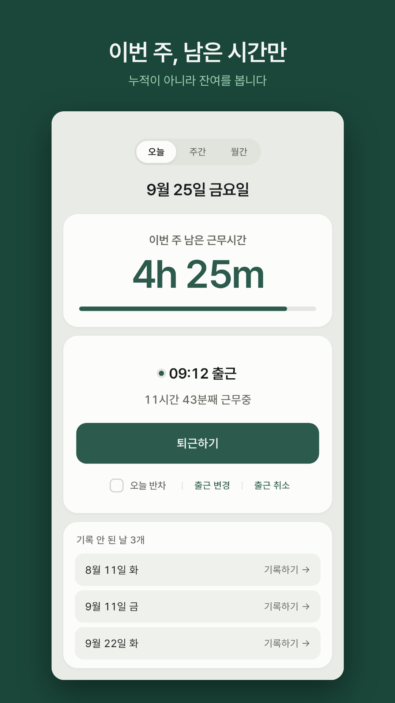
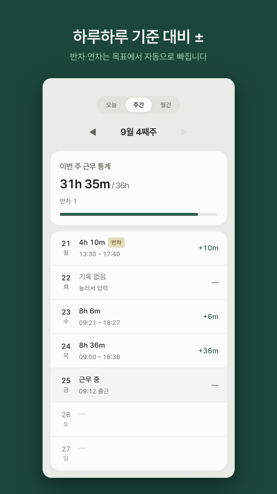
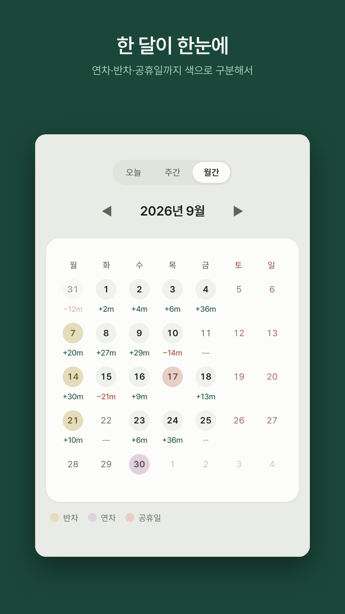
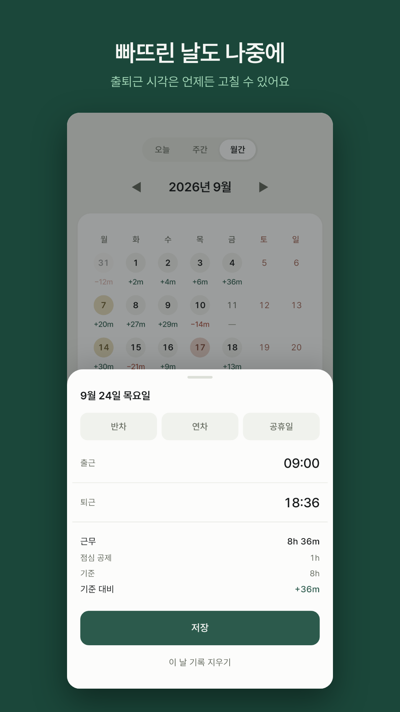

# SOI DUTY


주 40시간 유연근무 기준 근무시간 기록 앱. Flutter, 서버 없이 로컬로만 동작합니다.

출퇴근을 버튼으로 찍어서 **"이번 주에 얼마나 더 채워야 하는지"** 를 파악하는 게 목적입니다.
누적 근무시간을 보여주는 앱이 아니라 **잔여 시간**을 보여주는 앱입니다.

| 오늘 | 주간 | 월간 | 기록 수정 |
|---|---|---|---|
|  |  |  |  |

---

## 계산 규칙

이 앱의 본질은 화면이 아니라 계산입니다.

```
하루 실근무 = 퇴근 - 출근 - 점심 60분   (반차·주말은 점심 공제 없음)
주간 목표  = 40h - (반차 × 4h) - (연차 × 8h) - (공휴일 × 8h)
잔여      = 주간 목표 - 평일 실근무 합계
```

- **주 단위로 리셋됩니다. 이월 없음.** +2h인 주와 -2h인 주는 상쇄되지 않으므로
  월간 초과/부족 합계는 만들지 않았습니다. 합산하면 틀린 값이 됩니다.
- **기록이 없는 평일은 `normal`로 간주**해 목표에 8h가 그대로 들어갑니다.
  그래야 기록이 빠진 날이 잔여에서 부당하게 사라지지 않습니다.
- **주말은 목표에도 실적에도 들어가지 않습니다.** 기록은 가능하지만 기준 대비 ±는 없습니다.
- **파생값은 저장하지 않습니다.** 근무시간·잔여시간은 항상 계산으로 도출하므로
  규칙이 바뀌어도 데이터 마이그레이션이 필요 없습니다.

### 첫 주 예외

첫 기록일이 그 주의 월요일이 아니면 **그 주만 잔여 계산을 하지 않습니다.**
수요일에 설치했는데 월·화를 8h로 추측해 채우면 거짓말이 되기 때문입니다.
목표 없이 실적만 표시하고, 다음 주부터 정상 계산합니다.

---

## 기술 스택

| | |
|---|---|
| 상태관리 | Riverpod (코드젠 `@riverpod`) |
| 모델 | freezed + json_annotation |
| 로컬 저장 | Drift |
| 라우팅 | go_router (`StatefulShellRoute`) |
| 아키텍처 | Clean Architecture (presentation / domain / data) |

**Drift를 고른 이유**는 쿼리 결과를 스트림으로 흘려주기 때문입니다.
한 화면에서 기록을 고치면 다른 화면의 집계가 자동으로 갱신되는 게 이 앱의 핵심
요구사항인데, `StreamProvider`와 맞물려 이게 공짜로 해결됩니다.

**Fake 구현체는 만들지 않습니다.** Fake는 보통 UI를 미완성 데이터 소스에서
떼어놓기 위한 것인데, Drift는 로컬이라 항상 준비돼 있고 네트워크 대기도 실패도
없습니다. 테스트는 `NativeDatabase.memory()`로 실제 Drift를 인메모리 구동합니다.

```
lib/
├─ core/routing/        router(@riverpod GoRouter, 3 브랜치 PageView)
├─ core/presentation/   SizeConfig, format/
├─ ui/                  색상·타이포·사이즈 토큰
├─ domain/model/        WorkRecord, WorkType (freezed)
├─ domain/rules/        WorkRules + 계산 함수 (순수 Dart, 테스트 1순위)
├─ domain/repository/   Repository 인터페이스
├─ data/database/       Drift 테이블·AppDatabase
├─ data/repository/     Drift 구현체
└─ presentation/        today / week / month / record_edit / shell
```

`domain/`에는 `package:flutter` import를 금지하고, `presentation/`은 `data/`를
직접 import하지 않습니다 (프로바이더로만).

---

## 테스트

계산 규칙이 이 앱의 전부이므로 화면보다 계산을 먼저 검증합니다. **221개 통과.**

```bash
flutter test
```

고정해둔 것들:

- 일반/반차/주말의 점심 공제 분기
- 반차·연차·공휴일이 섞인 주의 목표 계산 (미리 찍은 미래 유형도 즉시 반영되는지)
- 기록이 없는 평일이 목표에 8h로 잡히는지
- 첫 주 예외 판정 (월요일 시작 여부)
- 기록 누락 탐색 범위와 오래된 순 정렬

레이아웃도 어긋나기 쉬운 곳만 고정합니다. 글꼴·간격 토큰을 바꾸면 여기서 먼저 터집니다.

- 주간 7행의 높이가 모두 같은지 (메모 유무로 1px씩 어긋나던 자리)
- 월간 캘린더 값이 잘리거나 축소되지 않는지 — **기기 폭 320~600 8종에서 그려진 폭 = 자연 폭**
- 오늘 화면 네 상태의 카드 높이가 같은지

---

## 실행

`dev` / `prod` 두 flavor가 있습니다. 코드는 같고 번들 ID·앱 이름만 다릅니다 —
실사용 앱과 시드 테스트용 앱을 한 폰에 나란히 설치하기 위한 것이지 서버 환경 분리가 아닙니다.

**flavor 없이 실행하면 실패합니다.**

```bash
flutter pub get
dart run build_runner build --delete-conflicting-outputs
flutter run --flavor dev
```

디버그 빌드에서는 날짜 헤더를 길게 눌러 **시계를 옮기고 시드를 넣을 수** 있습니다.
첫 주 예외나 기록 누락이 있는 주 같은 상황을 손으로 만들지 않고 바로 확인하기 위한 것으로,
릴리즈 빌드에는 진입 경로 자체가 없습니다 (`kDebugMode`).

---

## 의도적으로 하지 않은 것

- **서버·로그인·Firebase** — 완전 로컬로 동작합니다
- **공휴일 자동 조회** — 하드코딩도 API도 하지 않습니다. 연말마다 공휴일 목록
  갱신용 업데이트를 내고 싶지 않아서 사용자가 직접 찍습니다
- **월간 초과/부족 합계** — 주 단위 리셋 구조와 맞지 않습니다
- **자동 위치 기반 출퇴근** — 버튼으로만 찍습니다
- **파생값 저장** — 언제나 계산합니다
